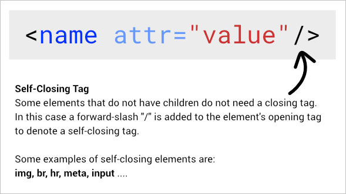

# HTML Cheatsheet
This is the cheatsheet for the basic syntax and terminologies of HTML.

Note: This is not an exhaustive list of all the elements HTML has. For an awesome [HTML Reference, click here.](https://developer.mozilla.org/en-US/docs/Web/HTML/Element)

## What is a syntax?
All languages have a syntax. English, Urdu, HTML, JavaScript all have a syntax. In English, we learn when to write commas, full-stops, paragraphs etc. Similarly there are syntax rules for HTML.

HTML is a markup language that has ONLY one thing - Elements. HTML is a collection of elements. A combination of elements are used to build a webpage.

## Syntax of an HTML Element

Not all elements have children, in that case the opening tag can close itself - AKA *Self-Closing Element/Tag*.

## Syntax of Self-Closing Element/Tag

## HTML References
The above was how to write HTML, now you may want to know all the different elements there are available in the HTML language.

Luckily, Mozilla and a ton of open source contributors have put together an [HTML Reference](https://developer.mozilla.org/en-US/docs/Web/HTML/Element)

It has a list of all HTML elements by category.