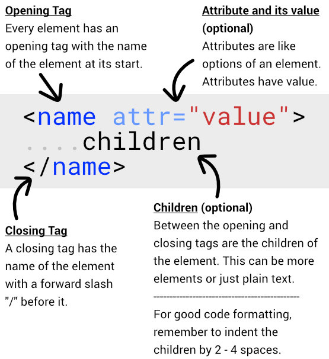

# 🔥 HTML Cheatsheet 🗺️
This is the cheatsheet for the basic syntax, terminologies, markup, and common elements of HTML.

Note: This is not an exhaustive list of all the elements HTML has. For an awesome [HTML Reference, click here.](https://developer.mozilla.org/en-US/docs/Web/HTML/Element)

Want to learn HTML & CSS? [here's an awesome video course](https://ilovecoding.org/courses/htmlcsss)

## I present to you - The HTML Cheatsheet 💪
[](html-cheatsheet.pdf)

Download [PDF](html-cheatsheet.pdf) or [Image](html-cheatsheet.gif)

## What is a syntax?
All languages have a syntax. English, Urdu, HTML, JavaScript all have a syntax. In English, we learn when to write commas, full-stops, paragraphs etc. Similarly there are syntax rules for HTML.

HTML is a markup language that has ONLY one thing - Elements. HTML is a collection of elements. A combination of elements are used to build a webpage.


## Rules of writing HTML Elements

#### 1. All elements have have an opening tag
`<openingtag>`

#### 2. The Opening tag has the name of the element `<elementname>`

#### 3. All elements close.

#### 4. Either elements self-close `<elementname />`

#### 5. or they close via a closing tag 
```
<elementname> // Opening tag
</elementname> // closing tag
```

#### 6. Elements optionally have attributes and attributes have value 
`<element att="value">`

#### 7. Elements optionally have children between the opening and closing tag
```
<elementname>
   children
</elementname>
```

These children can either be more elements or simply plain text
```
<elementname>
    <second>
        children of second element
    </second>

    <third>
        children of third element
    </third>
</elementname>
```

## 📋 HTML References
The above was how to write HTML, now you may want to know all the different elements there are available in the HTML language.

Luckily, Mozilla and a ton of open source contributors have put together an [HTML Reference](https://developer.mozilla.org/en-US/docs/Web/HTML/Element).

It has a list of all HTML elements by category.

## 👍 What to learn HTML & CSS?

Try the most [comprehensive HTML & CSS video course](https://iloveoding.org/courses/htmlcss) on iLoveCoding.

Learn how to code HTML & CSS and build simple and professional websites.

## Want an CSS Cheatsheet as well?

Check out this [CSS Cheatsheet](https://github.com/iLoveCodingOrg/css-cheatsheet)
